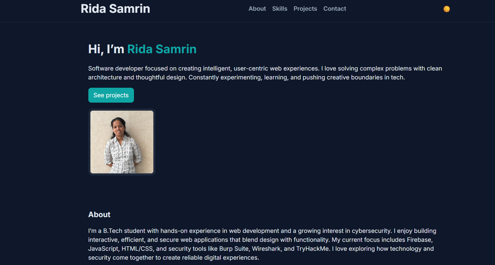

# 🌐 Personal Portfolio Website — [Your Name]

A single-page personal website that highlights my **skills, experiences, and projects**, 
built using **HTML, CSS, and JavaScript**.  
This website serves as my professional portfolio and personal brand identity.

---

## 🚀 Live Demo
🔗 [Visit the Website](https://rida-118-sam.github.io/portfolio-page)

---

## 🖼️ Screenshot


---

## 💡 About the Project
This project is a modern, fully responsive **personal portfolio website** designed to showcase my professional identity.  
It includes essential sections like:
- **Introduction**
- **About Me**
- **Skills**
- **Projects**
- **Contact**

The website is lightweight, fast, and optimized for all screen sizes.

---

## ✨ Features
- Clean, single-page responsive layout  
- Smooth scrolling navigation  
- Dark/Light theme toggle  
- Resume download button  
- Integrated contact form (via Formspree or similar)  
- Deployed using **GitHub Pages**

---

## 🛠️ Technologies Used
- **HTML5** — structure of the webpage  
- **CSS3** — for styling and responsiveness  
- **JavaScript (ES6)** — for interactivity (theme toggle, scroll, etc.)  
- **GitHub Pages** — for free hosting and deployment  

---

## Folder sturcture
personal-website/
├── index.html
├── css/
│   └── style.css
├── js/
│   └── main.js
├── images/
│   ├── profile.jpg
│   └── preview.png
└── README.md

---


## ⚙️ How to Run Locally
Follow these steps to run the website on your local machine:

```bash
# 1. Clone the repository
git clone https://github.com/rida-118-sam/portfolio-page.git

# 2. Navigate into the project folder
cd your-repo

# 3. Open index.html directly in your browser
# OR run a simple local server (Python 3)
python -m http.server 8000

